# React Native Mastery Showcase

## Objective

This React Native app interacts with the [JSONPlaceholder API](https://jsonplaceholder.typicode.com) to display, manage, and interact with posts, while showcasing best practices and advanced features.

### Screens and Functionality

1. **Post List Screen**:

   - Fetches and displays a list of posts.
   - Each post shows the title and body.
   - Includes a "View Details" button that navigates to the Post Details screen.
   - Handles loading states and errors during fetching.
   - Supports pagination and loading more posts as you scroll.
   - Users can search for posts by title.

2. **Add Post Screen**:

   - Allows the user to add a new post by filling out title and body fields.
   - Validates inputs to ensure fields are not empty.
   - After submission, the new post is added to the post list with optimistic UI updates.

3. **Post Details Screen**:

   - Displays full details of a selected post (title, body, and user ID).
   - Includes "Edit" and "Delete" buttons.
   - "Edit" button navigates to the Edit Post screen.
   - "Delete" button removes the post from the list and navigates back to the Post List screen.

4. **Edit Post Screen**:

   - Pre-fills a form with the current post details.
   - Allows the user to update the title and body fields.
   - Validates the form and saves the changes with optimistic UI updates.

5. **About Screen**:

   - Contains contact information and personal details.
   - Showcases the app developer's skills and experience.

6. **Theme Toggle**:

   - Allows users to toggle between light and dark themes for a personalized experience.

7. **Settings Screen**:
   - Provides options to configure app settings according to user preferences.

### Navigation

- Utilizes **React Navigation** for smooth screen transitions.

### State Management

- **Redux** is used to handle global state for managing the post list and its actions.

### Styling

- Ensures a responsive and consistent UI across all screens, utilizing **Styled Components** and **React Native styles**.

---

## Screenshots:

### Table: Screenshots of the app on Honor 9 Lite and Oppo A96 and for Dark & Light Themes

| Screen                       | Honor 9 Lite                                               | Oppo A96                                                    |
| ---------------------------- | ---------------------------------------------------------- | ----------------------------------------------------------- |
| **Welcome**                  | 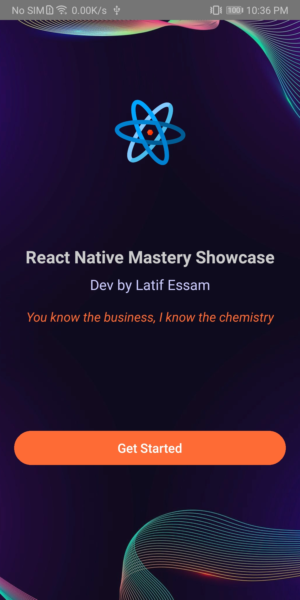 | 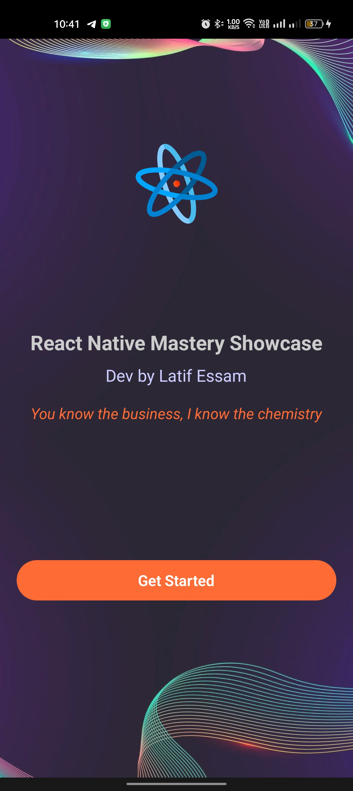        |
| **Login**                    | 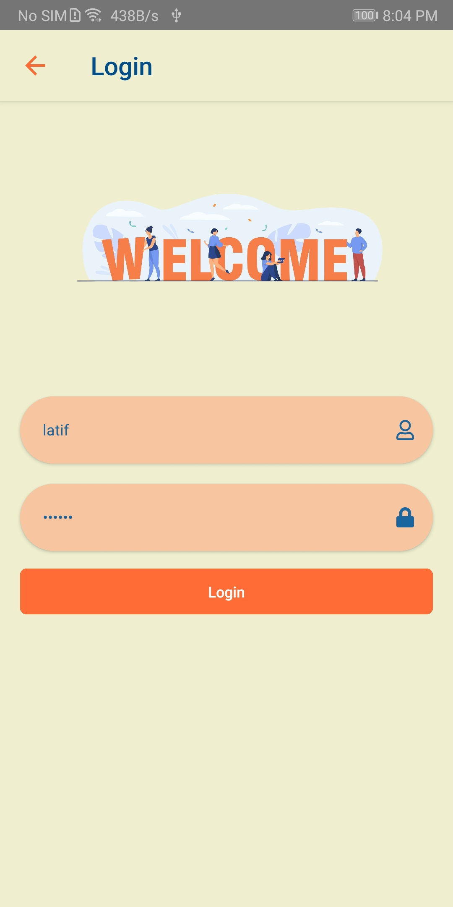   | 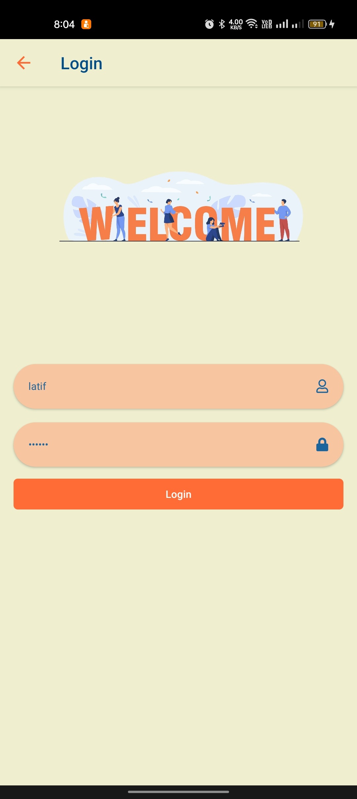        |
| **Home**                     | 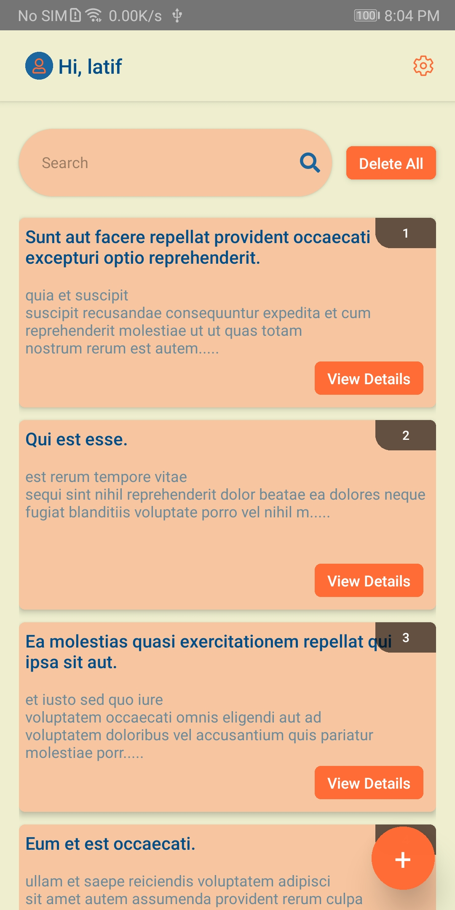    | 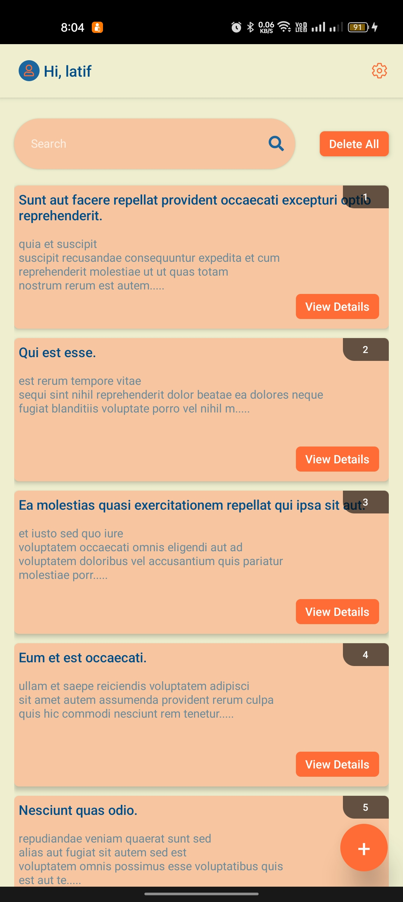         |
| **Post Details**             | 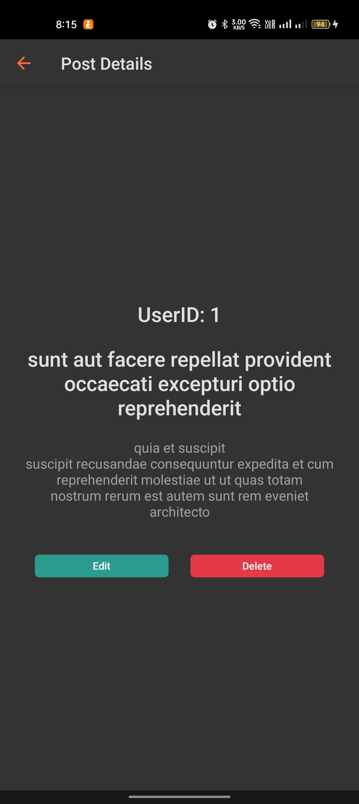   | 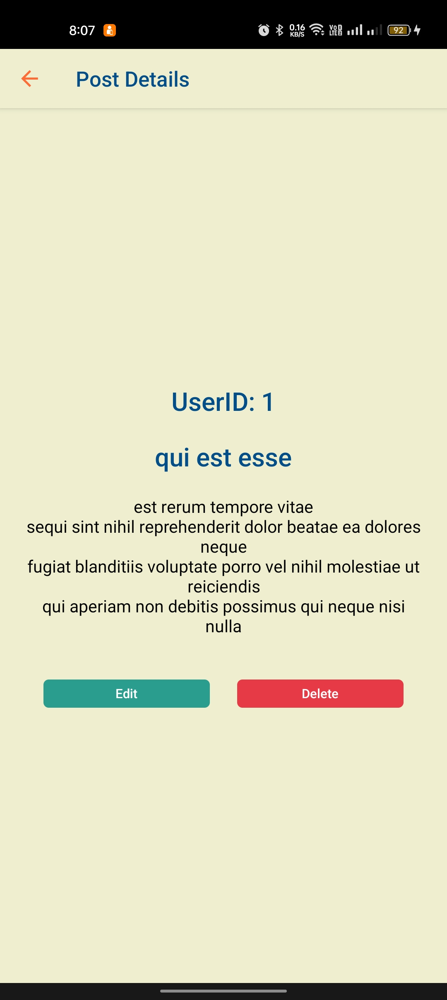      |
| **Add Post**                 | 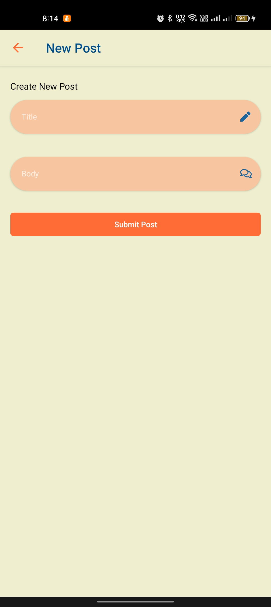 | 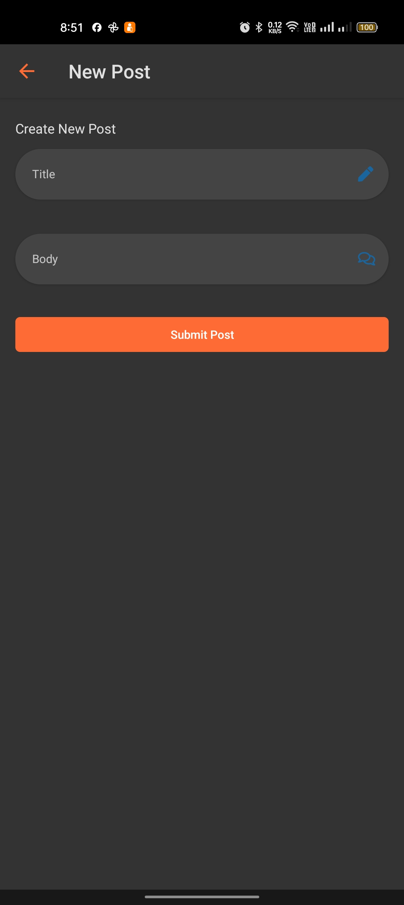        |
| **Edit Post**                |                                                            | 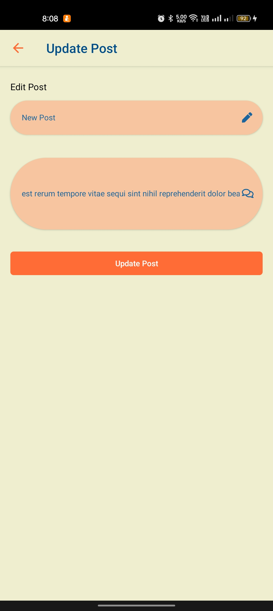 |
| **Delete Post Confirmation** |                                                            | 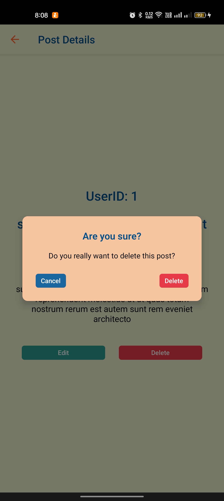  |
| **Settings**                 |                                                            | 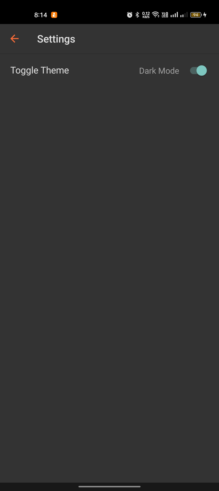        |
| **Search**                   |                                                            | 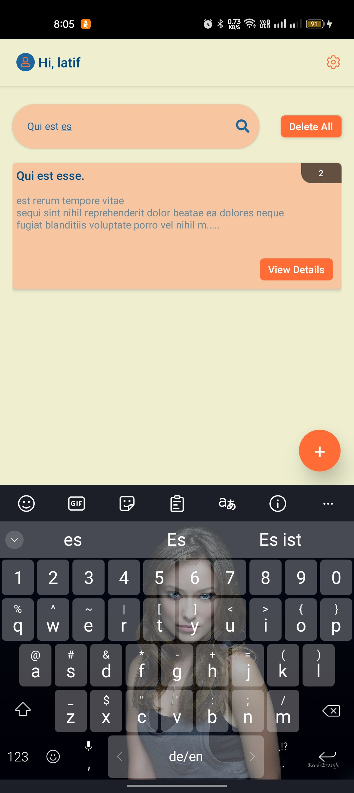          |

---

## Setup Instructions

### Prerequisites

Make sure you have the following software installed on your computer:

- **Node.js**: [Download Node.js](https://nodejs.org/)
- **Watchman**: (macOS only) [Install Watchman](https://facebook.github.io/watchman/docs/install.html)
- **React Native CLI Installation**: [React Native CLI Installation](https://reactnative.dev/docs/environment-setup)
- **Android Studio or VS code** (For Android development): [Set up Android Studio](https://reactnative.dev/docs/environment-setup), or [VS Code](https://code.visualstudio.com/)

### Steps to Run the App

1. **Clone the repository**:

   ```bash
   git clone https://github.com/latif-essam/react-native-mastery-showcase.git
   cd react-native-mastery-showcase
   ```

2. **Install dependencies**:

   ```bash
   npm install
   ```

3. **Run the app**:
   - For iOS:
     ```bash
     npx react-native run-ios
     ```
   - For Android:
     ```bash
     npx react-native run-android
     ```

### Running on Emulator

- If you don’t have an emulator setup, follow the instructions for [Setting up React Native environment](https://reactnative.dev/docs/environment-setup) to configure the simulator or use a physical device.

---

## Technologies Used

- **[React Native](https://reactnative.dev/)**: A framework for building cross-platform mobile applications with JavaScript and React.
- **[React Navigation](https://reactnavigation.org/)**: A popular library for handling navigation between screens in React Native apps.
- **[Redux](https://redux.js.org/)**: A predictable state container for JavaScript apps, used for managing the app's global state.
- **[Axios](https://axios-http.com/)**: A promise-based HTTP client for making requests to the JSONPlaceholder API and handling responses.
- **[React Native Vector Icons](https://github.com/oblador/react-native-vector-icons)**: A library that provides customizable icons for React Native applications.

---

## Conclusion

This app demonstrates my ability to handle state management, implement RESTful APIs, and create a user-friendly interface using React Native. I have also implemented additional features like a theme toggle and an About section to showcase my skills in React Native development.

---

**Thank you for reviewing my project. I hope it provides a comprehensive overview of my abilities and skills in React Native development.**
